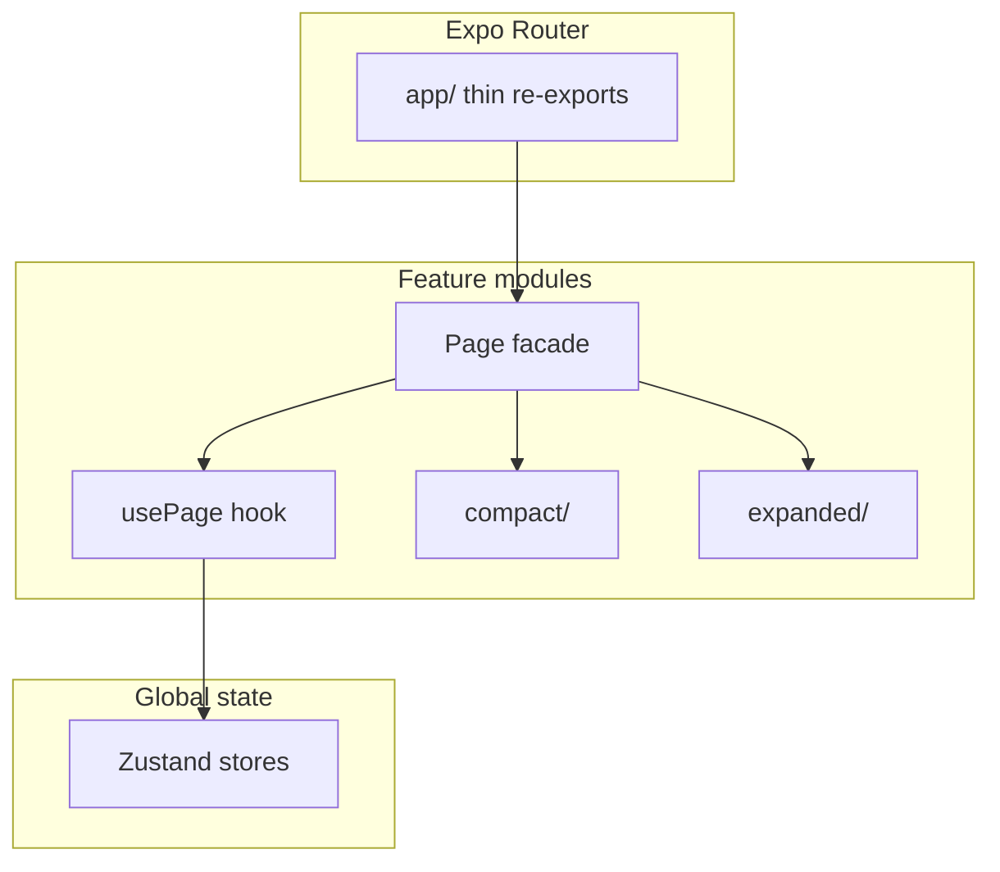

<p align="center">
  
</p>

<h1 align="center">FitFlow Showcase</h1>

<p align="center">
  A cross-platform fitness app for iOS, Android, and Web — built with Expo Router, adaptive layouts, and production-style patterns.
</p>

<p align="center">
  
  
  
  
  
</p>

<p align="center">
  <strong>Portfolio demo</strong> — uses placeholder API and CDN URLs. No production backend is bundled with this repository.
</p>

---

## What you'll find here

This repository is a **reference implementation** for reviewers who want to see how a real-world React Native app can be structured for mobile and web from a single codebase.

- **Adaptive layouts** — `compact` and `expanded` UIs driven by viewport width (breakpoint at 1000px), not separate apps
- **Workout flow** — video player, timed challenges, achievements, and a share modal
- **Programs catalog** — favorites, program detail, and nested workout navigation
- **Hacks** — short-form workout content with a streamlined player flow
- **Auth and onboarding** — Firebase Auth, survey, and training-streak screens
- **Cross-platform patterns** — `.web.tsx` file splits and platform-specific APIs (e.g. notifications)

## Preview

<p align="center">
  
</p>

<p align="center"><em>UI preview — run locally with <code>npx expo start</code></em></p>

## Architecture

The UI layer separates two independent axes:

| Axis | What changes | How |
| --- | --- | --- |
| **Layout** | Narrow vs wide viewport | `compact` / `expanded` via `useIsCompactLayout()` |
| **Platform** | iOS / Android / Web APIs | `Platform.OS`, `.web.tsx` extensions |



**How features are organized**

- **Thin routes** — `app/` screens re-export feature facades; routing stays separate from business logic
- **Feature modules** — each route lives under `components/features/<name>/` with a facade, a `use*Page` hook, and `compact/` / `expanded/` layout trees
- **Two scopes of shared UI** — `components/shared/` for cross-feature widgets (modals, video player, nav header); `features/<name>/shared/` for layout-agnostic pieces within one feature
- **Global state** — Zustand stores (`usersStore`, `programsStore`, `settingsStore`) with shallow selectors

Thin route example:

```tsx
// app/(tabs)/programs.tsx
export { default } from "@/components/features/programs";
```

Feature module layout (same pattern for `home`, `hacks`, `profile`, `login`, and others):

```
components/features/programs/
  ProgramsPage.tsx          # facade — picks compact or expanded
  useProgramsPage.ts        # shared state and effects
  ProgramsPage.compact.tsx
  ProgramsPage.expanded.tsx
  compact/                  # narrow-layout leaf UI
  expanded/                 # wide-layout leaf UI
  shared/                   # widgets used by both layouts
```

## Tech stack

| Layer | Choice |
| --- | --- |
| Framework | Expo SDK 54, React Native, Expo Router |
| State | Zustand |
| Auth | Firebase Auth |
| Video | expo-video / react-native-video |
| Animations | react-native-reanimated |
| API | Axios (`utils/api/`) |
| Config | `EXPO_PUBLIC_*` via [`utils/config/env.ts`](utils/config/env.ts) |

`react-native-video` is patched automatically on `npm install` via [`patch-package`](patches/react-native-video+6.16.1.patch).

## Quick start

**1. Install dependencies**

```bash
npm install
```

**2. Copy the environment template**

```bash
cp .env.example .env.local
```

On Windows:

```bash
copy .env.example .env.local
```

**3. Start the dev server**

```bash
npx expo start
```

Press `w` for web, or open the project in Expo Go / an emulator. For native builds, use a [development build](https://docs.expo.dev/develop/development-builds/introduction/).

**4. Optional — native Firebase config**

Required only for `expo run:ios` / `expo run:android` with real Firebase credentials:

```bash
mkdir -p secrets
cp config/firebase/GoogleService-Info.plist.example secrets/GoogleService-Info.plist
cp config/firebase/google-services.json.example secrets/google-services.json
```

Replace placeholder values with your own Firebase project. iOS provisioning profiles (`.mobileprovision`) belong in `secrets/ios/` — local only, never committed.

## Configuration

Runtime config is read from `EXPO_PUBLIC_*` variables. See [`.env.example`](.env.example) for the full list.

| Variable | Purpose |
| --- | --- |
| `EXPO_PUBLIC_API_URL` | Backend API base URL |
| `EXPO_PUBLIC_DO_HOST` | CDN host for static assets |
| `EXPO_PUBLIC_DEEP_LINK_HOST` | Deep link domain |
| `EXPO_PUBLIC_FIREBASE_*` | Firebase web SDK |
| `EXPO_PUBLIC_APPSFLYER_*` | AppsFlyer (native only) |
| `EXPO_PUBLIC_FACEBOOK_APP_ID` | Facebook share integration |
| `EXPO_PUBLIC_VAPID_PUBLIC_KEY` | Web push notifications |

Sensitive files (`secrets/`, `*.p12`, `*.pem`, `*.keystore`, `*.mobileprovision`) are gitignored. Templates live in `config/firebase/*.example`. Never commit real signing certs or API keys.

## Project structure

```
app/                         # Expo Router — thin re-exports only
components/
  features/                  # Page modules (facade, hooks, compact/, expanded/)
  shared/                    # Cross-feature UI
  common/  animations/       # Primitives and motion
hooks/                       # useLayoutVariant, useAppBootstrap, …
store/                       # Zustand stores
utils/                       # API, config, layout breakpoints
types/                       # Shared TypeScript types
config/firebase/             # Firebase config templates
secrets/                     # Local credentials (gitignored)
```

## Scripts

```bash
npm run lint            # ESLint
npm run format          # Prettier write
npm run format:check    # Prettier check (CI-friendly)
npm run android         # Run on Android
npm run ios             # Run on iOS
npm run web             # Start web target
```

---

<p align="center">Built as a portfolio showcase for cross-platform React Native development.</p>
